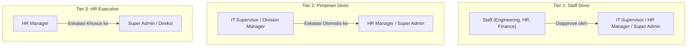

<div align="center">

# 🏢 Attention OS
### Modern Enterprise HRIS & Workforce Management System

[](https://laravel.com)
[](https://tailwindcss.com)
[](https://alpinejs.dev)
[-success?style=for-the-badge&logo=github-actions&logoColor=white)](#-pengujian-otomatis-automated-tests)
[](LICENSE)

<p align="center">
  <b>Attention OS</b> adalah platform manajemen sumber daya manusia (HRIS) dan absensi enterprise terintegrasi yang dirancang untuk mengelola presensi berbasis GPS Geofencing, hierarki persetujuan berjenjang (<i>Approval Matrix</i>), kuota cuti/lembur, rekapitulasi payroll, serta audit trail aktivitas sistem secara <i>real-time</i>.
</p>

</div>

---

## 📑 Daftar Isi

- [Fitur Utama](#-fitur-utama)
- [Arsitektur & Matriks Persetujuan](#-arsitektur--matriks-persetujuan-approval-matrix)
- [Akun Demo Siap Pakai](#-akun-demo-siap-pakai)
- [Teknologi yang Digunakan](#-teknologi-yang-digunakan)
- [Panduan Instalasi Lokal](#-panduan-instalasi-lokal)
- [Pengujian Otomatis (Automated Tests)](#-pengujian-otomatis-automated-tests)
- [Struktur Database & Modul](#-struktur-database--modul)
- [Keamanan & Tata Kelola Data](#-keamanan--tata-kelola-data)

---

## ✨ Fitur Utama

### 1. 📍 Presensi Berbasis GPS & Radius Geofencing
- **Deteksi Koordinat Presisi**: Menghitung jarak pengguna ke kantor secara akurat menggunakan algoritma *Haversine Formula*.
- **Multi-Cabang (*Multi-Branch*)**: Mendukung pengelolaan banyak kantor cabang dengan radius geofence masing-masing.
- **Peta Interaktif Leaflet.js**: Menampilkan visualisasi lingkaran radius geofence dan titik posisi pegawai secara *real-time*.
- **Deteksi Keterlambatan Otomatis**: Menghitung menit keterlambatan pegawai berdasarkan jadwal shift yang ditetapkan.

### 2. ⚖️ Matriks Persetujuan Berjenjang (*Multi-Tier Approval & Anti Self-Approval*)
- **Eskalasi Bertingkat**:
  - **Staff**: Disetujui oleh Supervisor Divisi, HR Manager, atau Super Admin.
  - **Supervisor & Manager Divisi**: Otomatis dialihkan ke HR Manager & Super Admin.
  - **HR Manager**: Hanya dapat disetujui oleh Super Admin / Direksi.
- **Anti Self-Approval**: Pemohon tidak dapat melihat atau menyetujui pengajuannya sendiri.
- **Modal Alasan Penolakan**: Karyawan dapat melihat alasan penolakan dan nama approver melalui tombol pop-up interaktif (👁️).

### 3. 🛡️ Audit Trail & Keamanan Sistem (*Activity Logs*)
- **Pencatatan Aktivitas Otomatis**: Merekam setiap aksi `CREATE`, `UPDATE`, `DELETE`, `APPROVE`, dan `REJECT` pada data master maupun permohonan.
- **Visual Diff Comparison**: Membandingkan nilai data "Sebelum vs Sesudah" secara berdampingan (*side-by-side*) dengan highlight perubahan.
- **Log Presensi Abadi (*Immutable Attendance*)**: Catatan absensi dilindungi dari penghapusan sembarangan demi kepatuhan audit & payroll.
- **Proteksi Karyawan Non-Aktif**: Akses ke seluruh portal ESS langsung dikunci (*HTTP 403 / Deactivated Card Notice*) jika status pegawai dinonaktifkan oleh HR.

### 4. 🏖️ Employee Self-Service (ESS) Portal
- **Dashboard Karyawan Ramah Mobile**: Dilengkapi live clock widget, status presensi harian, dan ringkasan kehadiran bulanan.
- **Manajemen Cuti & Izin**: Pengajuan cuti terintegrasi dengan pemotongan sisa kuota tahunan dan lampiran dokumen (surat dokter/pendukung).
- **Pengajuan Lembur (*Overtime*)**: Perhitungan durasi lembur otomatis berdasarkan jam mulai dan jam selesai.
- **Koreksi Absensi**: Memungkinkan karyawan mengajukan perbaikan jam masuk/pulang jika terjadi kendala teknis.

### 5. 📊 Laporan & Ekspor Data
- **Ekspor Laporan Presensi**: Unduh rekapitulasi kehadiran dalam format CSV/Excel berdasarkan rentang tanggal, divisi, dan status kehadiran.

---

## 🏛️ Arsitektur & Matriks Persetujuan (Approval Matrix)



---

## 👥 Akun Demo Siap Pakai

Halaman login (`/login`) telah dilengkapi tombol **Klik untuk Isi Cepat** untuk 4 peran hierarki utama:

| Peran Akun | Email | Password | Hak Akses & Cakupan |
| :--- | :--- | :--- | :--- |
| **Super Admin** | `admin@attention.test` | `password` | Akses penuh sistem, Master Data, Log Aktivitas Audit Trail, dan Approval Tertinggi. |
| **HR Manager** | `hr@attention.test` | `password` | Manajemen HR Global seluruh divisi, Approval tingkat perusahaan, dan Laporan Presensi. |
| **IT Supervisor** | `supervisor.eng@attention.test` | `password` | Approval khusus staf divisi Engineering & IT (Department-Scoped). |
| **IT Staff** | `staff.eng@attention.test` | `password` | Portal ESS, Clock-in/Clock-out GPS, Pengajuan Cuti & Lembur. |
| *Karyawan Non-Aktif* | `inactive.staff@attention.test` | `password` | *Uji coba card status non-aktif (Akses ditangguhkan).* |

---

## 💻 Teknologi yang Digunakan

- **Backend**: [Laravel 11.x](https://laravel.com) (PHP 8.2+)
- **Autentikasi & RBAC**: [Spatie Laravel-Permission](https://spatie.be/docs/laravel-permission)
- **Frontend & Styling**: [Tailwind CSS 3.4](https://tailwindcss.com) + [Vite](https://vitejs.dev)
- **Interaktivitas UI**: [Alpine.js 3.x](https://alpinejs.dev)
- **Peta & Geofence**: [Leaflet.js](https://leafletjs.com) (OpenStreetMap tiles)
- **Database**: SQLite (Default Lokal) / MySQL / PostgreSQL ready
- **Pengujian**: [PHPUnit](https://phpunit.de)

---

## 🚀 Panduan Instalasi Lokal

Ikuti langkah-langkah berikut untuk menjalankan Attention OS di komputer lokal Anda:

### 1. Clone Repository
```bash
git clone https://github.com/onlineclass0612-dot/attentio.git
cd attentio
```

### 2. Install Dependensi PHP & Node.js
```bash
composer install
npm install
```

### 3. Konfigurasi Environment File
Salin file `.env.example` menjadi `.env`:
```bash
cp .env.example .env
```
Generate application key:
```bash
php artisan key:generate
```

### 4. Setup Database & Jalankan Seeder Demo
```bash
touch database/database.sqlite
php artisan migrate:fresh --seed
```

### 5. Compile Aset Frontend & Jalankan Server
Buka terminal dan jalankan server pengembangan:
```bash
# Terminal 1: Vite Dev Server
npm run dev

# Terminal 2: Laravel Server
php artisan serve
```
Akses aplikasi melalui browser di **`http://localhost:8000`**.

---

## 🧪 Pengujian Otomatis (Automated Tests)

Aplikasi ini dilengkapi dengan rangkaian pengujian fitur (*Feature Tests*) dan unit yang ketat untuk menjamin integritas logika bisnis:

```bash
php vendor/phpunit/phpunit/phpunit
```

### Cakupan Pengujian (46 Tests, 164 Assertions - 100% Pass):
- ✅ `RolePermissionBoundaryTest`: Hak akses dan proteksi rute tiap peran.
- ✅ `SupervisorDepartmentScopingTest`: Isolasi wewenang supervisor per divisi.
- ✅ `TieredApprovalAndInactiveEmployeeTest`: Matriks persetujuan berjenjang dan proteksi akun non-aktif.
- ✅ `ActivityLogAndAttendanceAuditTest`: Audit trail dan pencegahan penghapusan log presensi.
- ✅ `AttendanceExportTest`: Validasi ekspor data laporan CSV/Excel.
- ✅ `DepartmentManagementTest`, `PositionManagementTest`, `ShiftManagementTest`: Validasi CRUD master data.
- ✅ `EmployeePortalTest`: Navigasi dan alur pengajuan ESS karyawan.

---

## 📂 Struktur Database & Modul

```
├── branches              # Data kantor cabang (Koordinat Latitude, Longitude, Radius Geofence)
├── departments           # Data divisi/departemen perusahaan (Engineering, HRD, Finance, dll.)
├── positions             # Data jabatan dan level hierarki (Director, Manager, Supervisor, Staff)
├── shifts                # Master shift kerja (Jam masuk, jam pulang, toleransi keterlambatan)
├── employees             # Profil lengkap pegawai (NIK, status kerja, shift default, status aktif)
├── attendances           # Log presensi harian (Jam clock-in/out, koordinat, foto, status hadir/telat)
├── leave_types           # Master tipe cuti & izin (Cuti Tahunan, Sakit, Izin Khusus, default kuota)
├── leave_balances        # Sisa kuota cuti pegawai per tahun
├── leave_requests        # Pengajuan cuti, status approval, approver ID, alasan penolakan
├── overtime_requests     # Pengajuan jam kerja lembur & uraian tugas
├── attendance_corrections# Pengajuan revisi presensi jika terjadi kendala teknis
└── activity_logs         # Log audit trail aktivitas admin (Diff perubahan data sebelum/sesudah)
```

---

## 🔒 Keamanan & Tata Kelola Data

1. **Prinsip Hak Akses Terkecil (*Principle of Least Privilege*)**: Supervisor hanya memiliki kendali pada staf di bawah departemennya sendiri.
2. **Perlindungan Data Pribadi (*Data Privacy*)**: Seluruh halaman internal dilengkapi tag meta `noindex, nofollow` untuk mencegah pengindeksan data sensitif oleh mesin pencari publik.
3. **Penyimpanan Password Aman**: Menggunakan algoritma *Bcrypt Hashing* dengan 12 round work factor.
4. **Proteksi Serangan Web**: Dilengkapi perlindungan CSRF Token di seluruh form, proteksi SQL Injection via Eloquent PDO binding, dan pembersihan XSS pada output Blade template.

---

<div align="center">
  <sub>Dikembangkan dengan ❤️ menggunakan Laravel & Tailwind CSS.</sub>
</div>
