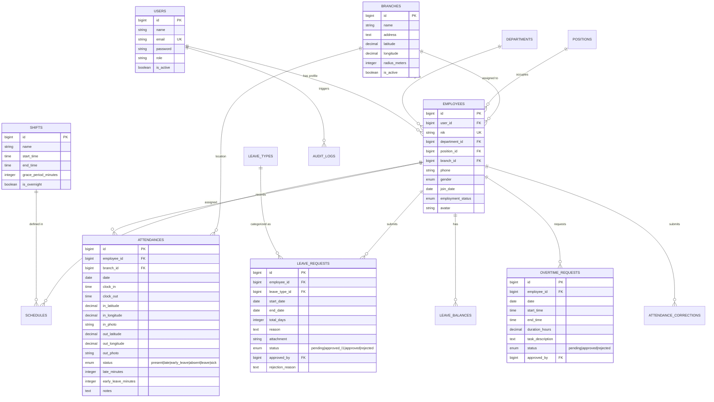
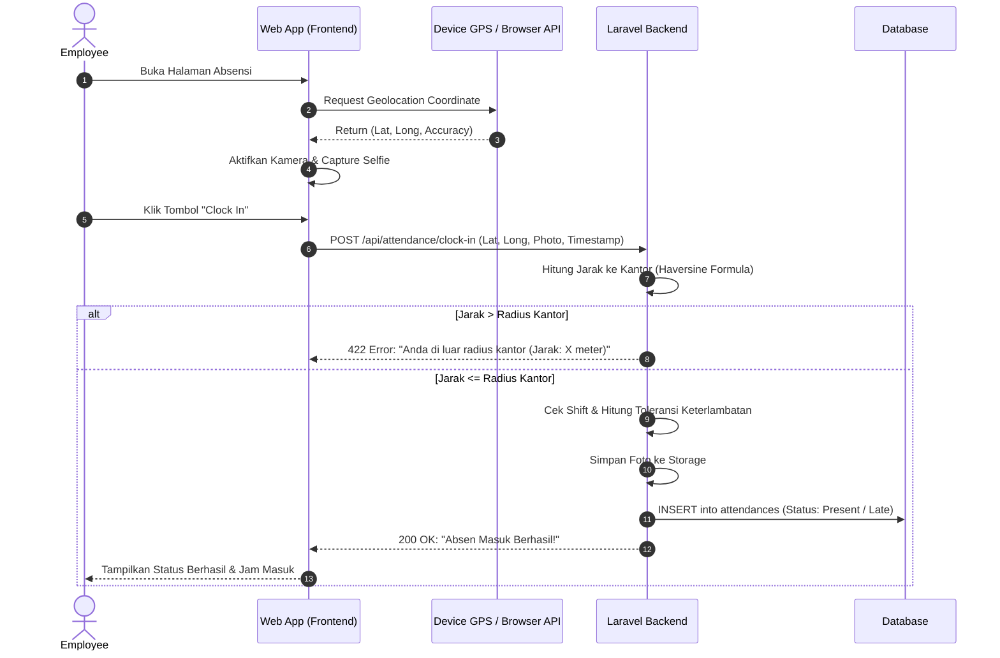
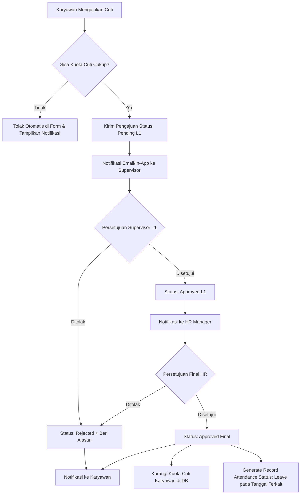

# Product Requirements Document (PRD)
## Project: Attention — Laravel-based HR & Attendance Management System

---

## 1. Executive Summary & Overview

### 1.1 Project Overview
**Attention** adalah sistem manajemen absensi dan kehadiran karyawan berbasis web (*Web-based HR Attendance & Workforce Management System*) yang dibangun dengan framework **Laravel**. Sistem ini dirancang untuk menyederhanakan pencatatan kehadiran secara *real-time*, memvalidasi lokasi kerja (*geofencing*), mengelola pengajuan izin/cuti/lembur secara terpusat, serta menyediakan rekapitulasi data otomatis yang siap diintegrasikan dengan modul *payroll*.

### 1.2 Vision & Goals
* **Akurasi Tinggi**: Mencegah kecurangan absensi (*buddy punching*) melalui verifikasi titik lokasi (GPS Geofencing) dan swafoto (*selfie verification*).
* **Efisiensi HR**: Mengeliminasi rekap absensi manual berbasis kertas/spreadsheet, menghemat hingga 80% waktu administrasi bulanan.
* **Transparansi & Self-Service**: Memberikan akses mandiri (*Employee Self-Service / ESS*) bagi karyawan untuk cek kuota cuti, riwayat absensi, slip/rekap kehadiran, dan status persetujuan.
* **Skalabilitas**: Arsitektur modular berbasis Laravel yang mudah dikembangkan untuk integrasi payroll, absensi shift bergilir (*rotating shifts*), dan multi-cabang (*multi-branch*).

---

## 2. User Personas & Role Matrix

| Role | Deskripsi | Hak Akses & Tanggung Jawab Utama |
| :--- | :--- | :--- |
| **Super Admin / System Admin** | Administrator sistem teknis | Manajemen user sistem, konfigurasi server, backup data, pengaturan global master data, audit logs. |
| **HR Admin / HR Manager** | Pengelola SDM & Kebijakan Kehadiran | Manajemen data karyawan, master kantor/lokasi (geofence), shift kerja, approval final cuti/lembur, generate laporan absensi bulanan, penyesuaian absensi manual. |
| **Supervisor / Manager Divisi** | Atasan langsung karyawan | Monitoring kehadiran tim harian, verifikasi & persetujuan tingkat pertama (Level-1 approval) untuk izin, cuti, lembur, dan koreksi absensi. |
| **Employee (Karyawan)** | Pengguna akhir / staf | Melakukan *Clock-In* & *Clock-Out* harian via mobile browser/desktop, mengajukan cuti/izin/sakit, mengajukan lembur, melihat sisa kuota cuti dan rekap kehadiran pribadi. |

---

## 3. Core Features & Functional Requirements

### 3.1 Authentication, Profile & RBAC (Role-Based Access Control)
* **FR-AUTH-01**: Multi-role login menggunakan email/NIK dan password terenkripsi (Bcrypt / Argon2).
* **FR-AUTH-02**: Dukungan Remember Me, Reset Password via Email Token, dan proteksi brute-force (Rate Limiting).
* **FR-AUTH-03**: Manajemen hak akses dinamis (*Permissions & Roles*) menggunakan package seperti `spatie/laravel-permission`.
* **FR-AUTH-04**: Profil karyawan lengkap (Biodata, NIK, Jabatan, Departemen, Tanggal Masuk, Status Kontrak, Kontak Darurat, Foto Profil).

---

### 3.2 Organization & Master Data Management
* **FR-ORG-01 (Kantor / Branches & Geofencing)**:
  * Menentukan titik koordinat kantor (*Latitude, Longitude*) dan radius toleransi absensi (misal: 50 meter).
  * Dukungan *multi-branch* / multi-lokasi kerja (Kantor Pusat, Cabang, Gudang, Remote/WFA).
* **FR-ORG-02 (Departemen & Jabatan)**: Pengelompokan struktur organisasi hierarkis (Direksi -> Manager -> Supervisor -> Staff).
* **FR-ORG-03 (Kalender Kerja & Hari Libur)**:
  * Pengaturan hari kerja standar (5 hari kerja / 6 hari kerja).
  * Master Hari Libur Nasional & Cuti Bersama (dapat di-import tahunan).

---

### 3.3 Shift & Schedule Management
* **FR-SHF-01 (Master Shift)**:
  * Definisi jam kerja: Jam Masuk (*Clock In*), Jam Pulang (*Clock Out*), Batas Awal Absen, Batas Keterlambatan (*Grace Period*, misal 15 menit), Jam Istirahat.
  * Tipe shift: Shift Normal (Office Hour), Shift Bergilir (Pagi/Siang/Malam), Flexible Hour, dan Shift Lintas Hari (*Overnight Shift*).
* **FR-SHF-02 (Roster & Penjadwalan)**:
  * Penugasan jadwal shift mingguan/bulanan per individu maupun per departemen.
  * Fitur tukar shift (*Shift Swap Request*) antar karyawan dengan persetujuan atasan.

---

### 3.4 Core Attendance Engine (Clock-In / Clock-Out)
* **FR-ATT-01 (Metode Validasi Kehadiran)**:
  1. **GPS Geolocation**: Membaca koordinat perangkat dan menghitung jarak Euclidean/Haversine terhadap koordinat kantor yang ditugaskan.
  2. **Camera Capture (Selfie Check-in)**: Mengambil foto wajah saat clock-in/out untuk verifikasi kehadiran fisik.
  3. **IP Address & Device Restriction** *(Opsional)*: Membatasi absensi hanya bisa diakses dari jaringan Wi-Fi kantor atau perangkat terdaftar.
  4. **Dynamic QR Code** *(Alternatif)*: Display layar kantor menampilkan QR code dinamis yang di-refresh tiap 15 detik untuk di-scan oleh aplikasi karyawan.
* **FR-ATT-02 (Kategori Status Absensi Otomatis)**:
  * `Present` (Hadir tepat waktu)
  * `Late` (Terlambat hadir — mencatat jumlah menit keterlambatan)
  * `Early Departure` (Pulang mendahului jam kerja)
  * `Absent / Alpha` (Tidak hadir tanpa keterangan — di-generate oleh *Automated Cron Job* di akhir hari)
  * `On Leave` (Sedang cuti yang telah disetujui)
  * `Sick` (Sakit berizin)
  * `Permission / Dinas Luar` (Tugas luar kantor)
* **FR-ATT-03 (Attendance Correction)**:
  * Karyawan dapat mengajukan perbaikan data absensi (misal: lupa absen keluar karena kendala perangkat) disertai alasan dan bukti.
  * Mengharuskan approval atasan sebelum mengubah status riwayat absensi.

---

### 3.5 Leave, Permission & Medical Leave Management (Manajemen Cuti & Izin)
* **FR-LEA-01 (Master Tipe Cuti)**:
  * Cuti Tahunan (*Annual Leave*), Cuti Melahirkan, Cuti Menikah, Cuti Duka Cita, Izin Khusus, Izin Sakit.
  * Konfigurasi kuota per tahun, periode reset (setiap tahun baru / tanggal kerja), dan carry-forward (apakah sisa cuti hangus atau bisa dibawa ke tahun depan).
* **FR-LEA-02 (Alur Pengajuan)**:
  * Karyawan memilih tipe cuti, tanggal mulai & selesai, alasan, serta melampirkan berkas (misal: Surat Keterangan Dokter untuk izin sakit).
  * Validasi otomatis: Mencegah pengajuan jika kuota sisa tidak mencukupi atau tanggal bertabrakan (*overlapping*).
* **FR-LEA-03 (Approval Workflow Multi-Level)**:
  * Level 1: Persetujuan Supervisor / Manager Divisi.
  * Level 2: Verifikasi akhir oleh HR Admin.
  * Notifikasi status (*Approved / Rejected*) dikirim ke karyawan secara realtime via in-app notification / email.

---

### 3.6 Overtime Management (Manajemen Lembur)
* **FR-OVT-01 (Pengajuan & Perintah Lembur)**:
  * Karyawan mengajukan lembur sebelum/sesudah jam kerja atau saat hari libur (*Pre-overtime / Post-overtime*).
* **FR-OVT-02 (Validasi & Kalkulasi Jam Lembur)**:
  * Sistem membandingkan jam lembur yang diajukan dengan jam aktual kepulangan (*actual clock-out*).
  * Perhitungan tarif jam lembur sesuai standar Depnaker / regulasi internal perusahaan (misal: jam ke-1 = 1.5x, jam berikutnya = 2x).
* **FR-OVT-03 (Approval Lembur)**: Persetujuan berjenjang oleh atasan langsung dan HR.

---

### 3.7 Real-time Dashboard & Analytics
* **FR-DSH-01 (HR / Admin Dashboard)**:
  * Widget statistik kehadiran hari ini: Total Karyawan, Hadir, Terlambat, Izin/Cuti, Alpha.
  * Peta Live Attendance (Lokasi terkini check-in karyawan).
  * Grafik tren kehadiran mingguan dan tingkat keterlambatan per departemen.
  * List pengajuan tertunda (*Pending Approvals*) yang membutuhkan tindakan segera.
* **FR-DSH-02 (Employee Dashboard)**:
  * Tombol cepat Clock-In / Clock-Out dengan indikator status GPS.
  * Rangkuman kehadiran bulan berjalan (Jumlah hadir, sisa jatah cuti, akumulasi jam lembur).
  * Riwayat log absensi 7 hari terakhir.

---

### 3.8 Reporting & Exporting (Laporan & Integrasi Payroll)
* **FR-REP-01 (Export Laporan Kehadiran)**:
  * Format: Excel (.xlsx), CSV, dan PDF.
  * Filter berdasarkan: Rentang Tanggal, Departemen, Lokasi Kantor, Status Kehadiran, Karyawan Spesifik.
* **FR-REP-02 (Payroll-Ready Summary Sheet)**:
  * Menghasilkan rekap agregat bulanan per karyawan: Total Hari Kerja, Total Hadir, Menit Terlambat, Total Jam Lembur, Potongan Alpha/Izin, Cuti Terpakai.
* **FR-REP-03 (Audit Trail & Activity Logs)**:
  * Mencatat setiap perubahan data sensitif (misal: koreksi absensi manual oleh HR, perubahan lokasi kantor) lengkap dengan Timestamp, User ID, dan IP Address.

---

## 4. Technical Architecture & Tech Stack

```
+-------------------------------------------------------------------------+
|                                FRONTEND                                 |
|   Blade Templates / Livewire 3 + Alpine.js + Tailwind CSS (Vite)        |
|   Leaflet.js / OpenStreetMap API (Map & Geolocation Client)             |
|   Webcam.js / HTML5 MediaDevices API (Camera Capture)                   |
+-------------------------------------------------------------------------+
                                    |
                                    v (HTTP / HTTPS / Inertia / AJAX)
+-------------------------------------------------------------------------+
|                                BACKEND                                  |
|   Framework    : Laravel 11.x / 12.x (PHP 8.2+)                         |
|   Auth & RBAC  : Laravel Breeze / Fortify + Spatie Laravel Permission   |
|   Admin Panel  : Custom Tailwind Blade / Filament v3                    |
|   Excel/PDF    : Maatwebsite/Laravel-Excel, DomPDF / Browsershot        |
|   Geo Distance : Haversine Formula (Custom Helper / Spatial DB)         |
+-------------------------------------------------------------------------+
                                    |
             +----------------------+----------------------+
             |                                             |
             v                                             v
+-----------------------------+               +--------------------------+
|          DATABASE           |               |   QUEUE & FILE STORAGE   |
| MySQL 8.0+ / PostgreSQL 15+ |               | Redis (Queues & Cache)   |
| Eloquent ORM + Migrations   |               | Local / AWS S3 (Selfies) |
+-----------------------------+               +--------------------------+
```

### 4.1 Technology Stack Details
* **Language & Framework**: PHP 8.2+, Laravel 11.x / 12.x
* **Database**: MySQL 8.0+ / MariaDB 10.6+ / PostgreSQL 15+
* **Frontend UI**: Tailwind CSS v3/v4, Alpine.js, Blade UI Components, FontAwesome / Lucide Icons.
* **Admin Ecosystem Option**: Filament PHP v3 *(sangat direkomendasikan untuk efisiensi pembuatan admin CRUD)* atau Custom Blade Dashboard.
* **Asynchronous Jobs & Cron**:
  * Laravel Task Scheduling: Auto-mark absent employees at 23:59 daily (`attendance:reconcile`).
  * Laravel Queues: Pengiriman notifikasi email dan kompresi foto selfie.
* **Maps & Location Service**: Leaflet.js + OpenStreetMap (Bebas biaya) atau Google Maps JavaScript API.
* **File Storage**: Laravel Storage Disk (Local storage dengan symlink atau Cloud S3 untuk storage foto selfie absensi dan surat dokter).

---

## 5. High-Level Database Schema (ERD Overview)



---

## 6. Workflows & System Processes

### 6.1 Daily Attendance Flow (Clock-In)



### 6.2 Leave Request & Multi-tier Approval Flow



---

## 7. Non-Functional Requirements (NFRs)

### 7.1 Security & Data Privacy
* **Geofence Spoofing Protection**: Validasi `accuracy` GPS pada level browser; tolak koordinat jika accuracy > 50 meter.
* **Data Protection**: Enkripsi password menggunakan `bcrypt` / `argon2id`, proteksi route dengan middleware `auth` dan `verified`.
* **File Upload Security**: Validasi ketat MIME type (`image/jpeg, image/png, application/pdf`), batasan ukuran file (maks 2MB), dan enkripsi nama file acak (*UUID/Hash*).
* **CSRF & XSS Prevention**: Seluruh form POST/PUT dilindungi token CSRF standar Laravel dan sanitasi output Blade (`{{ }}`).

### 7.2 Performance & Scalability
* **Query Optimization**: Menggunakan *Eager Loading* (`with(['employee', 'branch'])`) untuk mencegah masalah *N+1 Query*.
* **Caching**: Cache master data (Branches, Shifts, Holidays) menggunakan Laravel Cache / Redis.
* **Photo Compression**: Otomatis me-resize dan mengompres foto selfie absensi menjadi resolusi efisien (maks 800x600 px / ~150KB) sebelum disimpan ke disk storage via package `intervention/image`.

### 7.3 Availability & Reliability
* **Cron Reconciliation**: Scheduler Laravel berjalan setiap malam untuk memeriksa karyawan yang tidak melakukan Clock-In dan secara otomatis menandai statusnya sebagai `Absent (Alpha)` jika tidak ada record izin/cuti yang disetujui.

---

## 8. Implementation Roadmap & Milestones

```
+----------------------------------------------------------------------------+
| MILESTONE 1: Foundation & Core Setup (Sprint 1)                            |
| - Setup Laravel 11/12 project, Tailwind CSS, Database Migrations           |
| - Authentication, Roles & Permissions (Spatie), Employee Profile CRUD      |
| - Master Data: Branches, Geofence, Departments, Positions, Shifts          |
+----------------------------------------------------------------------------+
                                      |
                                      v
+----------------------------------------------------------------------------+
| MILESTONE 2: Attendance Engine & Geofencing (Sprint 2)                     |
| - Frontend Clock-In / Clock-Out UI with GPS Locator & Camera Snapshot      |
| - Haversine Geofence validation & late calculations                        |
| - Shift Scheduling & Daily Attendance Reconciliation Cron Job              |
+----------------------------------------------------------------------------+
                                      |
                                      v
+----------------------------------------------------------------------------+
| MILESTONE 3: Leave, Overtime & Approvals (Sprint 3)                        |
| - Leave & Permission Request Module with File Attachments                  |
| - Overtime Submission & Calculation Engine                                 |
| - Multi-level Approval Dashboard for Managers & HR                         |
+----------------------------------------------------------------------------+
                                      |
                                      v
+----------------------------------------------------------------------------+
| MILESTONE 4: Dashboard, Reporting, Export & Polish (Sprint 4)              |
| - Interactive Analytics Dashboard (Charts, Live Map, KPI Widgets)          |
| - Export Attendance & Payroll Summary (Excel, CSV, PDF)                    |
| - User Testing, Security Hardening, & Deployment Readiness                 |
+----------------------------------------------------------------------------+
```

---

## 9. Success Metrics (KPIs)

1. **Akurasi Data Presensi**: 0% data kehadiran fiktif karena validasi ganda (GPS Radius + Foto Selfie Wajah).
2. **Kecepatan Proses Rekapitulasi**: Waktu pembuatan laporan absensi bulanan berkurang dari **3-5 hari kerja** menjadi **kurang dari 1 menit** (1-Click Export).
3. **Turnaround Time Approval**: Waktu persetujuan izin/cuti/lembur rata-rata di bawah **24 jam**.
4. **Adopsi Pengguna**: >95% karyawan berhasil melakukan absensi mandiri tanpa kendala teknis.

---

## 10. Open Questions & Recommendations for Implementation

> [!TIP]
> **Rekomendasi UI Stack**: Gunakan **Filament v3** untuk bagian Admin & HR panel karena mempercepat pembuatan CRUD master data, tabel filter, export excel, dan manajemen role hingga 3x lipat, sementara sisi Karyawan (ESS Mobile View) dapat menggunakan custom **Blade + Tailwind + Alpine.js** agar tampil ramping dan seperti aplikasi mobile native (PWA).

> [!NOTE]
> **PWA (Progressive Web App)**: Sangat disarankan menambahkan package `silviolleite/laravel-pwa` agar karyawan dapat menginstal sistem web ini langsung ke layar utama (*homescreen*) smartphone Android/iOS mereka tanpa perlu melalui Google Play Store / App Store.
